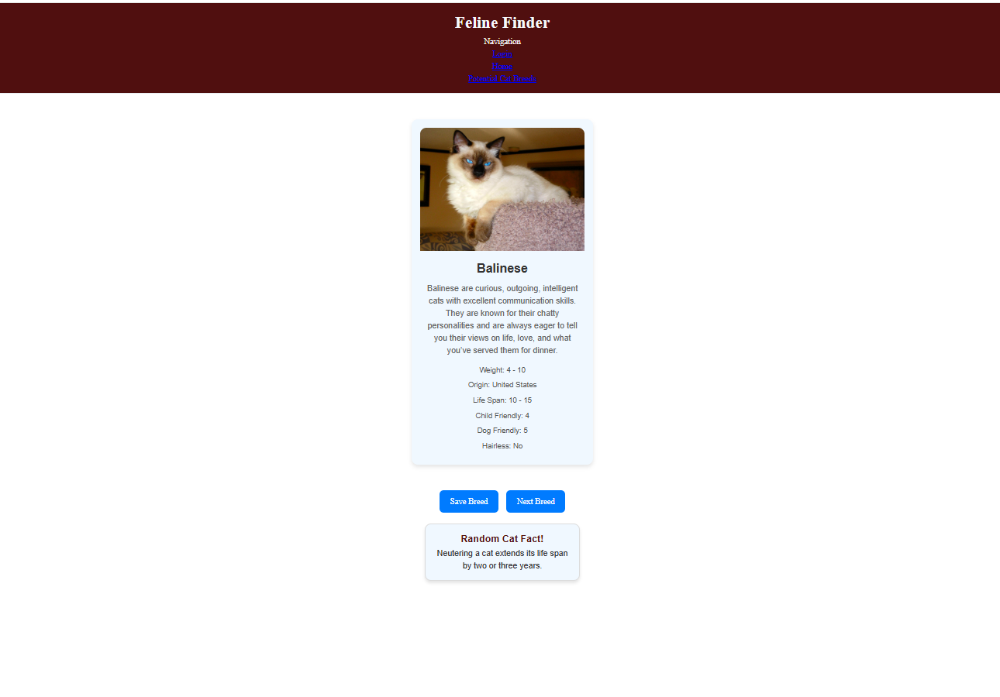

# Feline Finder: An Interactive Full-Stack Web Application 

## Websites: 
- [GitHub Link](https://github.com/BlazeEMP/Project-2)
- [Deployed Link](https://render.com)

## Description
This is an interactive Search App using a navigation component to search breeds of cats by displaying images of cats as well as their weight, origin, life span, indoor cat, child friendly, dog friendly, and hairless, . This app was built using Node.js and Express to create a RESTful API, React for the client side and PostgreSQL and Sequelize ORM for the database and the use of JSON Web Token (JWT) for authentification.

## Application Homepage

## Table of Contents
- [Installation](#installation)
- [Usage](#usage)
- [Credits](#credits)
- [License](#license)
- [Features](#features)
- [Tests](#tests)
- [Contact](#contact)

## Installation
`npm install` <!-- TODO: add installation packages/dependencies-->

## Usage
`cd server npm run dev`

## Credits
Primary contributors: Daniel Blair, Paolo Sierra; Secondary contributor: Nancy Watreas

## License
MIT

## Features
This application consist of **ADD CONTENT

## Tests
1. Start server: `cd server npm run dev`
2. Start React development server: `cd client npm run dev`

## Contact
If there are any questions or concerns, we can be reached at:
##### github: https://github.com/BlazeEMP 
##### github: https://github.com/Narupo
##### github: https://github.com/noIDEA-tech
<!-- (https://github.com/https://github.com/BlazeEMP; https://github.com/Narupo; https://github.com/noIDEA-tech) -->

TODO: ADD EMAILS HERE  ##### [email: nwatreas2023@gmail.com](mailto:nwatreas2023@gmail.com)